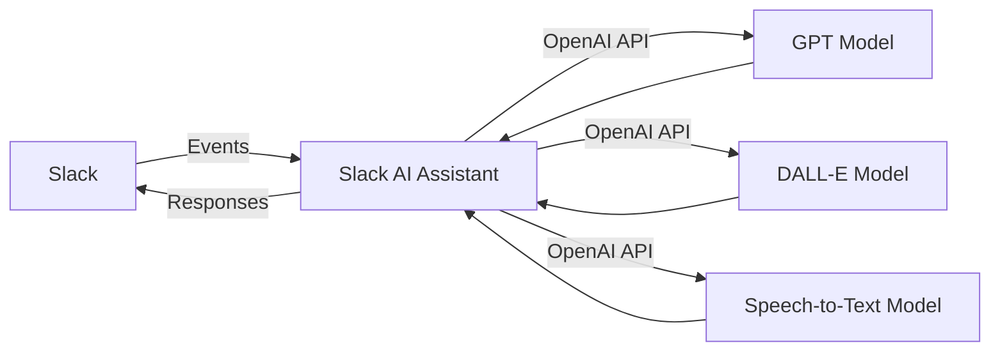

Slack AI Assistant 
https://langflow-slackbot-etopd9brf-namastex-labs.vercel.app/
# Introduction

Welcome to the Slack AI Assistant, a powerful tool designed to revolutionize the way you interact with your Slack workspace. By harnessing the capabilities of advanced AI technologies, such as OpenAI's GPT and DALL-E models, this assistant brings intelligent conversation, image generation, and speech-to-text functionality directly to your Slack channels.

## Key Features

The Slack AI Assistant offers a wide range of features to enhance your Slack experience:

- **Natural Language Conversation**: Engage in seamless, context-aware conversations with the AI assistant, just as you would with a human. The assistant understands and responds to your messages intelligently, providing helpful information and guidance.

- **Image Generation**: Bring your ideas to life with the AI assistant's image generation capabilities. Simply describe the image you want, and the assistant will generate a stunning visual representation using OpenAI's DALL-E model.

- **Speech-to-Text**: Dictate your messages effortlessly using the speech-to-text functionality. The AI assistant accurately transcribes your audio input, making it easier than ever to communicate hands-free.

- **Customizable Behavior**: Tailor the AI assistant's personality and responses to suit your preferences. By modifying the system prompt and environment variables, you can create a unique assistant that aligns with your team's needs and culture.

<Callout type="info" emoji="ℹ️">
The Slack AI Assistant is designed to be user-friendly and easy to set up, even for those without extensive technical knowledge. The [Getting Started](/getting-started) guide will walk you through the process step-by-step.
</Callout>

## How It Works

The Slack AI Assistant leverages a combination of cutting-edge technologies to deliver its intelligent features:

1. The assistant listens for events in your Slack workspace, such as direct messages, mentions, and trigger words.
2. When an event is detected, the assistant processes the input and sends a request to the appropriate AI model (GPT for conversation, DALL-E for image generation, or Speech-to-Text for audio transcription) via the OpenAI API.
3. The AI model generates a response based on the input and sends it back to the Slack AI Assistant.
4. The assistant formats the response and sends it back to the user in Slack.

This seamless integration of Slack and OpenAI's powerful language models enables the Slack AI Assistant to provide intelligent, context-aware responses in real-time.

## Getting Started

To start using the Slack AI Assistant in your workspace, follow these steps:

<Steps>

### Install the Assistant

Install the Slack AI Assistant by cloning the repository and installing the required dependencies. Detailed instructions can be found in the [Installation](/getting-started/installation) guide.

### Configure the Environment

Set up the necessary environment variables, such as API keys and custom settings, to ensure the assistant functions properly. The [Configuration](/getting-started/configuration) section provides a comprehensive overview of the available options.

### Invite the Assistant to Your Channels

Add the Slack AI Assistant to the desired channels in your workspace, so it can start listening for events and responding to your messages.

</Steps>

Once you've completed these steps, you'll be ready to start interacting with the Slack AI Assistant and unlocking the full potential of AI-powered collaboration in your workspace. To learn more about using the various features of the assistant, check out the [Usage](/usage) section.
